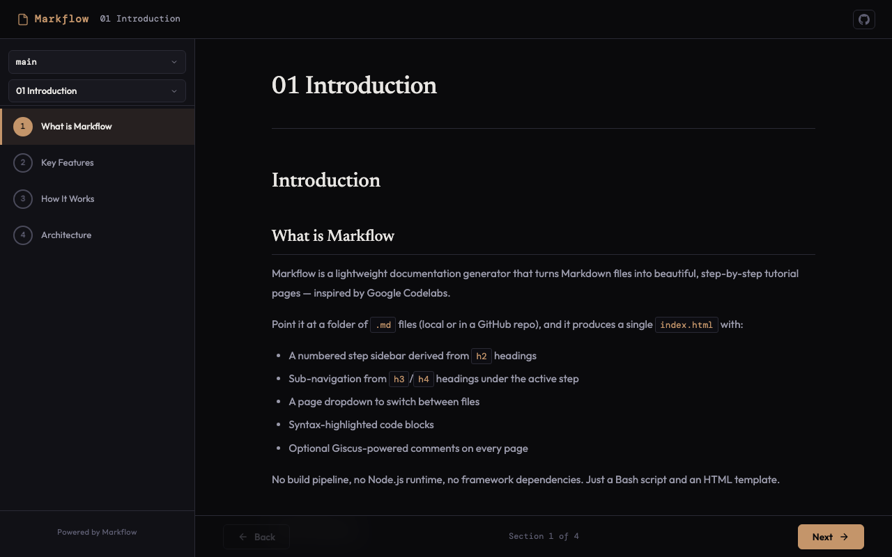

# Markflow

Turn Markdown files into beautiful, step-by-step tutorial pages — inspired by Google Codelabs.



## Features

- **Zero dependencies** — Bash CLI, single-file HTML output
- **GitHub-native** — fetches Markdown from any repo, supports branch/tag switching
- **Pre-baking** — embed content at build time for instant loads and offline use
- **Theming** — 14 CSS variables for full color customization
- **Social links** — GitHub, Twitter/X, Discord, LinkedIn, YouTube, website icons
- **Giscus comments** — GitHub Discussions-powered comments on every page
- **Responsive** — desktop, tablet, and mobile layouts

## Quick Start

**Install:**

```bash
curl -sL https://raw.githubusercontent.com/darmie/markflow/main/install.sh | bash
```

**Initialize:**

```bash
markflow init
```

Edit the generated `.env` with your repo details:

```env
MARKFLOW_REPO_OWNER=your-org
MARKFLOW_REPO_NAME=your-repo
MARKFLOW_REPO_ROOT=docs
MARKFLOW_BRAND_NAME=My Docs
```

**Build:**

```bash
markflow build --prebake --source ./docs
```

**Preview:**

```bash
markflow serve
# Open http://localhost:3000
```

## Writing Docs

Create `.md` files in your docs directory. Markflow uses your heading structure for navigation:

- `# H1` — page title
- `## H2` — numbered steps in the sidebar
- `### H3` / `#### H4` — sub-items under the active step

Files are sorted alphabetically — use numeric prefixes to control order:

```
docs/
├── 01-introduction.md
├── 02-getting-started.md
└── 03-reference.md
```

## CLI Usage

| Command | Description |
|---------|-------------|
| `markflow init` | Create `.env` config file |
| `markflow build` | Generate `index.html` |
| `markflow build --prebake --source ./docs` | Build with embedded content |
| `markflow build --output ./public` | Custom output directory |
| `markflow build --config ./custom.env` | Use custom config file |
| `markflow serve` | Preview at `localhost:3000` |
| `markflow serve --port 8080` | Preview on custom port |

## Deploy to GitHub Pages

Create `.github/workflows/deploy-docs.yml`:

```yaml
name: Deploy Docs

on:
  push:
    branches: [main]

permissions:
  contents: read
  pages: write
  id-token: write

concurrency:
  group: pages
  cancel-in-progress: true

jobs:
  deploy:
    runs-on: ubuntu-latest
    environment:
      name: github-pages
      url: ${{ steps.deployment.outputs.page_url }}
    steps:
      - uses: actions/checkout@v4

      - name: Build docs
        run: |
          chmod +x ./markflow
          ./markflow build --prebake --source ./docs --output ./site --config ./docs/.env

      - uses: actions/configure-pages@v5

      - uses: actions/upload-pages-artifact@v3
        with:
          path: ./site

      - id: deployment
        uses: actions/deploy-pages@v4
```

Enable GitHub Pages in **Settings > Pages > Source: GitHub Actions**, then push to `main`.

## Configuration

All options are set in `.env`. Run `markflow init` to generate a template.

| Variable | Default | Description |
|----------|---------|-------------|
| `MARKFLOW_REPO_OWNER` | — | GitHub owner (required) |
| `MARKFLOW_REPO_NAME` | — | Repository name (required) |
| `MARKFLOW_REPO_BRANCH` | `main` | Default branch |
| `MARKFLOW_REPO_ROOT` | — | Subdirectory for docs |
| `MARKFLOW_BRANCH_SWITCHER` | `true` | Show branch/tag dropdown |
| `MARKFLOW_BRAND_NAME` | `My Docs` | Header title |
| `MARKFLOW_BRAND_LOGO` | — | SVG file, URL, or inline SVG |
| `MARKFLOW_ACCENT` | `#c4956a` | Primary accent color |
| `MARKFLOW_GISCUS_REPO` | — | Enable Giscus comments |

See [full documentation](https://darmie.github.io/markflow/) for all theme colors and social link options.

## License

MIT
